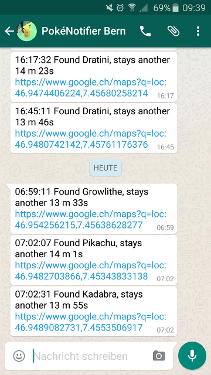

# PokeNotifier-Whatsapp

Notifier for Pokemon Go, get updates about appearing pokemon in your city via Whatsapp, based on [PokemonGo-Map](https://github.com/AHAAAAAAA/PokemonGo-Map).



This is **not** a native plugin, extension or fork of PokemonGo-Map, it's merely a script that accesses a running map server.

One advantage is that you can simply update the server by redeploying it to Heroku and hack around in the script locally, or run it when needed.

After installing and configuring as follows, you can start it with simply running

    python pokenotifier.py

Notice: Using PokemonGo-Map is probably against the TOS and you may get banned from Pokemon Go.

## Installation

First, head over to [PokemonGo-Map](https://github.com/AHAAAAAAA/PokemonGo-Map) and [deploy the app to Heroku](https://github.com/AHAAAAAAA/PokemonGo-Map/wiki/Heroku-Deployment) or similar, do a full installation. You'll need the following:
* a throwaway Google account (or pokemon trainer account - for the Pokemon Go login, don't use your real account, the one used here has some risk of getting banned)
* a Heroku account (or other account for deployment, or set it up locally)
* Google Maps API key, just follow the tutorial over at PokemonGo-Map: [Google Maps API key](https://github.com/AHAAAAAAA/PokemonGo-Map/wiki/Google-Maps-API-Key)

## Configuration

All configuration is in config.json. If `repeat` is set to true, the configuration will be reloaded each time the script runs, so changes to `rare_pokemon` or `server`-URL will be applied in the next run without restarting.

```json
{
    "rare_pokemon": [1, 2, 3, 4, 5, 6, 7, 8, 9, 25, 144, 145, 146, 147, 148, 149, 150, 151],
    "coords": {
        "ne": [46.9629, 7.466357],
        "sw": [46.9429, 7.437958]
    },
    "server": "https://your-map-server.herokuapp.com",
    "whatsapp": {
        "sender": "41791234567",
        "sender_pw": "3jHkhGHVIJF4dDIBIkhbjg87jkbb=",
        "recipient": "41791234567-1442956787"
    },
    "repetition": {
        "repeat": true,
        "delay_sec": 10
    }
}
```

Some explanation:
* All pokemon you specify in `rare_pokemon` will trigger a notification once found. You can build your own list by adding pokemon ids (using a list like [pokewiki.de](http://pokewiki.de/Pok%C3%A9mon-Liste)). The notification will be only triggered once per encounter.
* If `repeat` is set to false, the script will run only once. This will be useful if you want to run it via `cron` or something.
* The coordinates are specified as a rectangle, so you'll specify the upper right corner with the `ne` tuple and the lower left with `sw`.
* Whatsapp sender and sender_pw have to be configured as follows.
* Whatsapp Recipient can be a single number or a group, see configuration below.

### Whatsapp / Yowsup

For whatsapp notifications, you'll need the following:
* a separate, activated SIM card (and a phone for getting a one-time registration sms)
* the yowsup library

#### Install Yowsup

First, install yowsup in the directory this file lies:

    git clone https://github.com/tgalal/yowsup
    cd yowsup
    python setup.py install

After building (this may take a while), the `yowsup` folder should now be a subfolder and contain a file named `yowsup-cli`, which we're gonna need for registration and sending messages.

#### Register number

The registration is needed to send messages. You'll need to first send a request for registration, this will send you a SMS with a code, and then send that code for confirmation. `--cc` is the country code flag, you'll need to set it accordingly (41 is Switzerland).

Request registration SMS:

    yowsup-cli registration --requestcode sms --phone 41791234567 --cc 41

Register with code:

    yowsup-cli registration --register xxx-xxx --phone 41791234567 --cc 41

You'll then receive a confirmation:

> status: ok
kind: free
pw: 3jHkhGHVIJF4dDIBIkhbjg87jkbb=
price: CHF 1.00
price_expiration: 1472454114
currency: CHF
cost: 1.00
expiration: 4444444444.0
login: 41791234567
type: new

The important part is the `pw`. Test if it worked by sending a sample text to the number specified with `-s`:

    yowsup-cli demos -l 41791234567:3jHkhGHVIJF4dDIBIkhbjg87jkbb= -s 41793214567 'Hello Whatsapp!'

If everything went well you should receive a message and you can plug in `sender` and `sender_pw` in `config.json`.

#### Sending to a group

You can also send to a group. To do this, first add your sender nr. to a new group, then find the id of that group:

    yowsup-cli demos --yowsup -l 41791234567:3jHkhGHVIJF4dDIBIkhbjg87jkbb=
    /L              # login
    /groups list    # the group number will show up as id, something like 41791234567-1442956787
